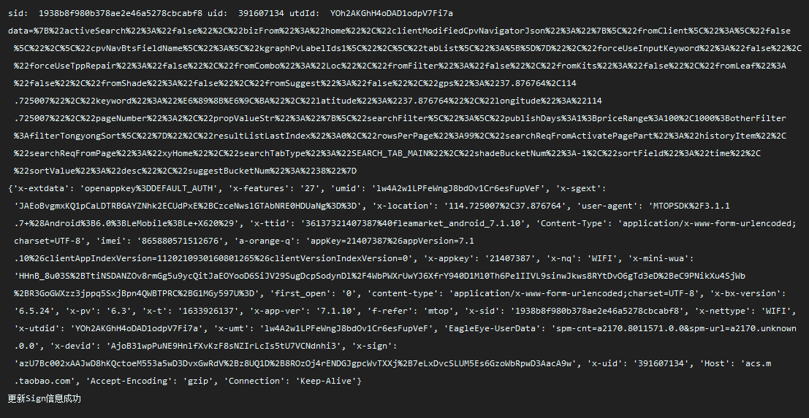

### 闲鱼x sign参数研究

### idlefish-xianyu-x-sign-and-request-params
idlefish/xianyu x-sign and request params

最近研究了下闲鱼以x sign为代码的请求参数，包括x-sign, x-mini-wua, x-umt等等参数。

效果如下，可以看到基本的请求参数和请求包数据都已经在里面了。

上面的是post包，下面是请求头数据，基本参数都在了。

声明下仅供研究学习使用。



```data=%7B%22activeSearch%22%3A%22false%22%2C%22bizFrom%22%3A%22home%22%2C%22clientModifiedCpvNavigatorJson%22%3A%22%7B%5C%22fromClient%5C%22%3A%5C%22false%5C%22%2C%5C%22cpvNavBtsFieldName%5C%22%3A%5C%22kgraphPvLabelIds1%5C%22%2C%5C%22tabList%5C%22%3A%5B%5D%7D%22%2C%22forceUseInputKeyword%22%3A%22false%22%2C%22forceUseTppRepair%22%3A%22false%22%2C%22fromCombo%22%3A%22Loc%22%2C%22fromFilter%22%3A%22false%22%2C%22fromKits%22%3A%22false%22%2C%22fromLeaf%22%3A%22false%22%2C%22fromShade%22%3A%22false%22%2C%22fromSuggest%22%3A%22false%22%2C%22gps%22%3A%2237.876764%2C114.725007%22%2C%22keyword%22%3A%22%E6%89%8B%E6%9C%BA%22%2C%22latitude%22%3A%2237.876764%22%2C%22longitude%22%3A%22114.725007%22%2C%22pageNumber%22%3A2%2C%22propValueStr%22%3A%22%7B%5C%22searchFilter%5C%22%3A%5C%22publishDays%3A1%3BpriceRange%3A100%2C1000%3BotherFilter%3AfilterTongyongSort%5C%22%7D%22%2C%22resultListLastIndex%22%3A0%2C%22rowsPerPage%22%3A99%2C%22searchReqFromActivatePagePart%22%3A%22historyItem%22%2C%22searchReqFromPage%22%3A%22xyHome%22%2C%22searchTabType%22%3A%22SEARCH_TAB_MAIN%22%2C%22shadeBucketNum%22%3A-1%2C%22sortField%22%3A%22time%22%2C%22sortValue%22%3A%22desc%22%2C%22suggestBucketNum%22%3A%2238%22%7D
```
```
{'x-extdata': 'openappkey%3DDEFAULT_AUTH', 'x-features': '27', 'umid': 'lw4A2w1LPFeWngJ8bdOv1Cr6esFupVeF', 'x-sgext': 'JAEoBvgmxKQ1pCaLDTRBGAYZNhk2ECUdPxE%2BCzceNwslGTAbNRE0HDUaNg%3D%3D', 'x-location': '114.725007%2C37.876764', 'user-agent': 'MTOPSDK%2F3.1.1.7+%28Android%3B6.0%3BLeMobile%3BLe+X620%29', 'x-ttid': '36137321407387%40fleamarket_android_7.1.10', 'Content-Type': 'application/x-www-form-urlencoded;charset=UTF-8', 'imei': '865880571512676', 'a-orange-q': 'appKey=21407387%26appVersion=7.1.10%26clientAppIndexVersion=1120210930160801265%26clientVersionIndexVersion=0', 'x-appkey': '21407387', 'x-nq': 'WIFI', 'x-mini-wua': 'HHnB_8u03S%2BTtiNSDANZOv8rmGg5u9ycQitJaEOYooD6SiJV29SugDcpSodynDl%2F4WbPWXrUwYJ6XfrY940D1Ml0Th6Pe1IIVL9sinwJkws8RYtDvO6gTd3eD%2BeC9PNikXu4SjWb%2BR3GoGWXzz3jppq5SxjBpn4QWBTPRC%2BG1MGy597U%3D', 'first_open': '0', 'content-type': 'application/x-www-form-urlencoded;charset=UTF-8', 'x-bx-version': '6.5.24', 'x-pv': '6.3', 'x-t': '1633926137', 'x-app-ver': '7.1.10', 'f-refer': 'mtop', 'x-sid': '1938b8f980b378ae2e46a5278cbcabf8', 'x-nettype': 'WIFI', 'x-utdid': 'YOh2AKGhH4oDAD1odpV7Fi7a', 'x-umt': 'lw4A2w1LPFeWngJ8bdOv1Cr6esFupVeF', 'EagleEye-UserData': 'spm-cnt=a2170.8011571.0.0&spm-url=a2170.unknown.0.0', 'x-devid': 'AjoB31wpPuNE9HnlfXvKzF8sNZIrLcIs5tU7VCNdnhi3', 'x-sign': 'azU7Bc002xAAJwD8hKQctoeM553a5wD3DvxGwRdV%2Bz8UQ1D%2B8ROzOj4rENDGJgpcWvTXXj%2B7eLxDvcSLUM5Es6GzoWbRpwD3AacA9w', 'x-uid': '391607134', 'Host': 'acs.m.taobao.com', 'Accept-Encoding': 'gzip', 'Connection': 'Keep-Alive'}


```

